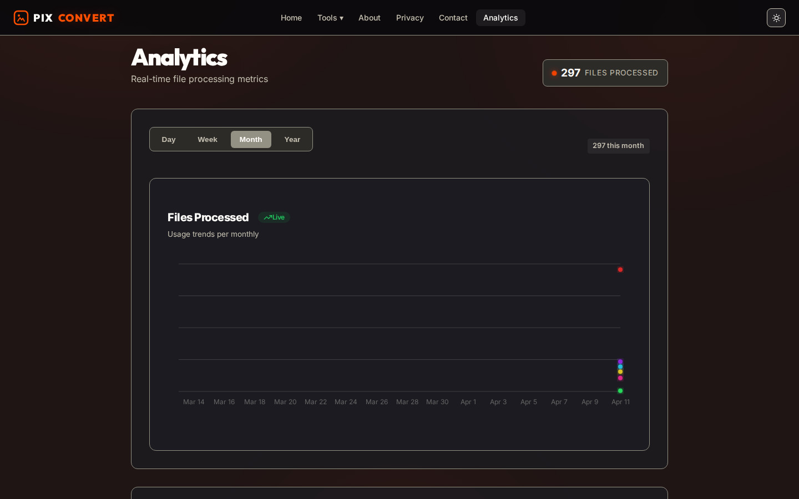

# PixConvert — Every tool you need for PDFs & Images

  

PixConvert is a free, privacy-focused, and open-source file conversion ecosystem. It enables users to convert, merge, protect, and edit files entirely in the browser, ensuring no data ever leaves the local environment.

---

## ✨ Latest Features

### 📊 Real-time Analytics Dashboard
Powered by Server-Sent Events (SSE), the dashboard provides live metrics on file processing trends. Features high-performance **Glowing Line Charts** and **Animated Donut Charts**.

  

### 👻 Animated Ghost 404 Page
A high-quality, animated 404 error page featuring a floating ghost mascot and an interactive **FlowButton** for quick redirection.

  

### 🖱️ Smart Navigation
A compact, organized navigation system that categorizes 40+ tools into collapsible sections.

  

---

## 🎨 Dual-Theme Support
Seamlessly switch between professional Dark mode and clean Light mode.

  

---

## 🛠️ Tech Stack

- **Frontend**: React 19, Vite, TailwindCSS, Framer Motion (High-end animations).
- **Charts**: Recharts with custom SVG filters.
- **Backend**: Node.js, Express 5 (Serverless-ready).
- **Real-time**: Server-Sent Events (SSE) for live metric streaming.
- **Persistence**: Atomic JSON local storage with 2-year data purging.
- **Infrastructure**: Docker, Nginx (Load Balancing), Auto-scaling.

---

## 🚀 Docker & Infrastructure

The repo includes a portable production container setup:

- `Dockerfile`: Multi-stage build for frontend and Express server.
- `docker-compose.yml`: Full stack with Nginx edge and persistent volumes.
- `nginx.scaling.conf`: Configured for SSE support and load balancing.

### Quick Start (Local)

1. **Install dependencies**: `npm install`
2. **Start development**: `npm run dev`
3. **Start backend**: `npm run server`

---

## 🔒 Privacy First
- **Local Processing**: Heavy file operations happen in-browser via Web Workers.
- **Zero Tracking**: No user-identifiable data is collected.
- **Open Source**: Audit the code yourself.
