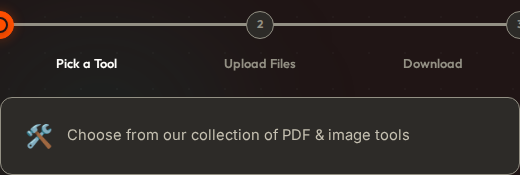
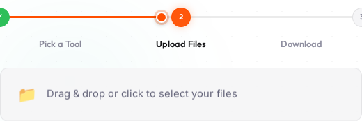
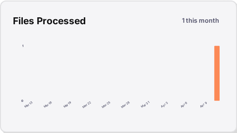
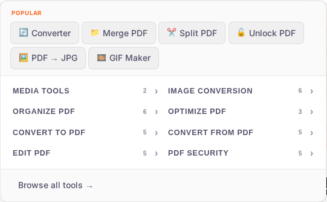
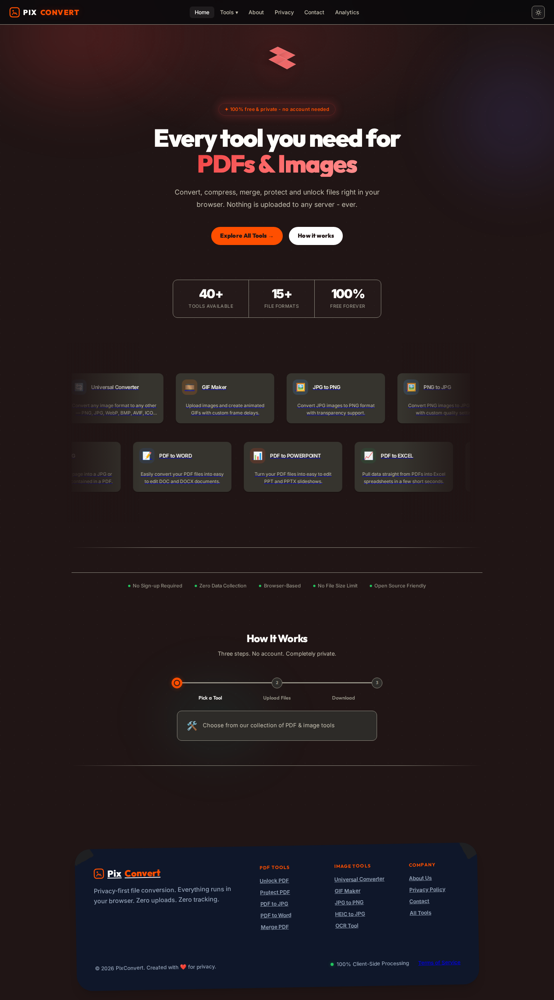
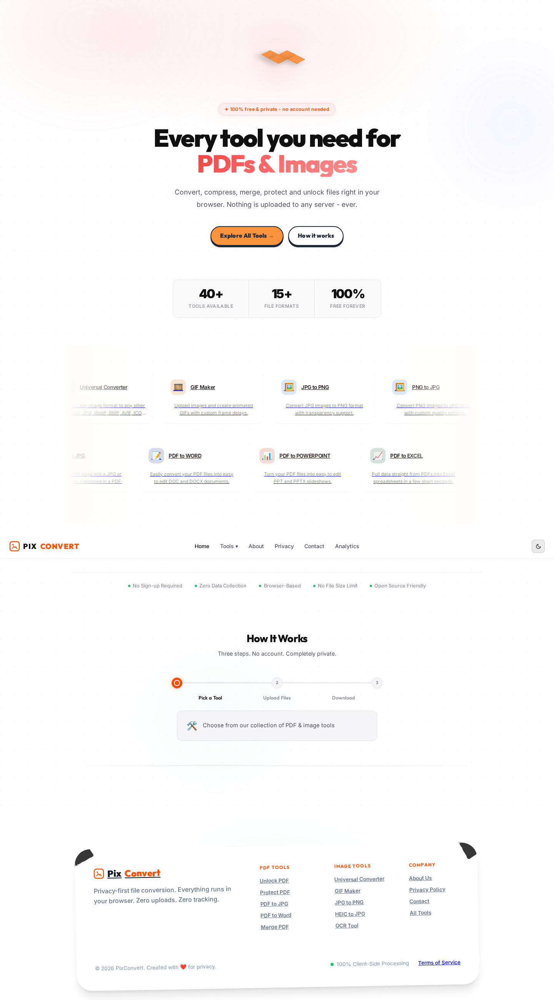

# PixConvert — Every tool you need for PDFs & Images

PixConvert is a free, privacy-focused, and open-source file conversion ecosystem. It enables users to convert, merge, protect, and edit files entirely in the browser, ensuring no data ever leaves the local environment.

## ✨ Latest Features

### 1. Interactive "How It Works" Timeline
A custom-built, drag-based timeline that guides users through the simple 3-step process. Features fluid animations and real-time step previews.

| Dark Mode | Light Mode |
| :---: | :---: |
|  |  |

### 2. Real-time Analytics Dashboard
Powered by Server-Sent Events (SSE), the dashboard provides live metrics on file processing trends and top-performing tools without requiring a page refresh.

| Analytics Dashboard (Dark) | Data Visualization |
| :---: | :---: |
|  |  |

### 3. Collapsible Smart Dropdown
A compact, organized navigation system that categorizes 40+ tools into collapsible sections, making it effortless to find the exact tool you need.



---

## 🎨 Dual-Theme Interface
The entire application is built with a responsive, high-performance UI that supports seamless switching between professional Dark mode and clean Light mode.

### Home Page

*Professional dark theme with vibrant accent colors.*


*Clean, high-contrast light theme for optimal readability.*

---

## 🛠️ Tech Stack

- **Frontend**: React 19, Vite, TailwindCSS (for foundational styling), Vanilla CSS (for custom interactions).
- **Backend**: Node.js, Express 5 (Serverless-ready).
- **Real-time**: Server-Sent Events (SSE) for live metric streaming.
- **Persistence**: Atomic JSON-based local storage with automatic 2-year data purging.
- **Visuals**: Pure SVG charts and custom CSS animations.
- **DevOps**: Docker, Nginx (Load Balancing), and custom Auto-scaling scripts.

---

## 🚀 Docker & Infrastructure

The repo includes a portable production container setup:

- `Dockerfile`: Multi-stage build for frontend and Express server.
- `docker-compose.yml`: Full stack with Nginx edge and persistent volumes for metrics.
- `nginx.scaling.conf`: Reverse proxy configured for SSE support and load balancing.
- `scripts/docker-autoscale.mjs`: CPU/RAM-based autoscaler for the application service.

### Quick Start (Local)

1. **Install dependencies**:
   ```bash
   npm install
   ```
2. **Start development server**:
   ```bash
   npm run dev
   ```
3. **Start backend**:
   ```bash
   npm run server
   ```

### Run in Docker

```bash
docker compose up --build -d
```

### CPU/RAM Autoscaling

Run the host-side autoscaler to manage replicas dynamically:
```bash
npm run autoscale:docker
```

---

## 🔒 Privacy First
- **Local Processing**: Heavy file operations (PDF merging, Image conversion) happen in-browser via Web Workers.
- **Zero Tracking**: No user-identifiable data is collected. Analytics only track tool usage counts and timestamps.
- **Open Source**: Audit the code yourself.
